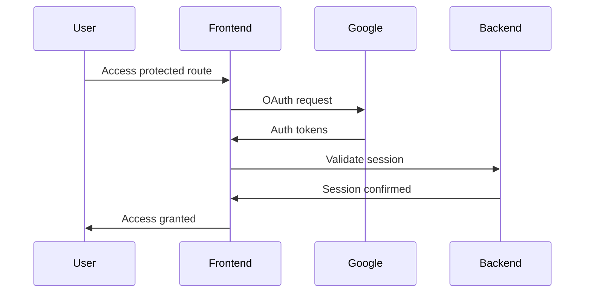

# Visualize-All-AI Frontend Integration Status

## ✅ Completed Features
1. Authentication Implementation
   - Google OAuth integration with NextAuth.js
   - Protected routes setup
   - Session management
   - Token handling and refresh flow
   - Error page handling

2. Basic UI Components
   - Responsive navigation
   - Theme switching (dark/light mode)
   - Protected route wrapper
   - Loading states

3. Initial Visualization Setup
   - Mermaid.js integration
   - Basic drive structure visualization
   - Responsive layout for visualizations

## 🔄 Current Focus: Drive Visualization
We're now moving to enhance the visualization capabilities:
```typescript
// Current visualization features
- Basic Mermaid.js integration
- Drive structure representation
- Real-time session handling
```

### Next Visualization Tasks
1. Implement dynamic drive data fetching
2. Create interactive node system
3. Add real-time updates via WebSocket
4. Enhance visualization styling

## 🔗 Backend Integration Points

### Current API Integration
```typescript
interface APIEndpoints {
  auth: '/api/auth/*',  // Handled by NextAuth
  drive: '/api/drive/*', // To be implemented
  visualization: '/api/visualization/*' // To be implemented
}
```

### Required Backend Support
1. Drive API Integration
   - File structure endpoints
   - Metadata access
   - Permission handling

2. Real-time Updates
   - WebSocket connection for live updates
   - Drive change notifications
   - Collaboration events

## 🚀 Deployment Status
- Development: Running on localhost:3000
- Production: Configured for aireinvestor.com/aivizdata
- CI/CD: GitHub Actions workflow implemented

## 📝 Current Implementation Details

### Authentication Flow


### Visualization Architecture
```typescript
interface VisualizationSystem {
  components: {
    MermaidDiagram: React.FC<{chart: string}>;
    DriveStructure: React.FC;
    InteractiveNodes: React.FC;
  };
  data: {
    nodes: DriveNode[];
    edges: Edge[];
    metadata: Record<string, any>;
  };
  updates: {
    websocket: WebSocket;
    refreshRate: number;
  };
}
```

## 🔜 Next Steps
1. Enhance drive visualization
2. Implement WebSocket connection
3. Add real-time updates
4. Create interactive features
5. Optimize performance

## 🤝 Backend Requirements
1. Drive structure endpoints
2. Real-time update system
3. Data transformation APIs
4. Performance optimization support

## 📊 Progress Tracking
```
Authentication:     🟢 Complete
Basic UI:          🟢 Complete
Visualization:     🟡 In Progress
Real-time Updates: ⚪️ Not Started
API Integration:   🟡 Partial
```

## 🔧 Development Guide
```bash
# Start development
npm run dev

# Build production
npm run build

# Run tests
npm run test
```

## 🔐 Security Considerations
1. OAuth token management
2. Protected route implementation
3. API request authentication
4. WebSocket security

## 📚 Documentation Status
- Authentication flow documented
- Visualization components documented
- API integration guide updated
- Deployment process documented

## 🐛 Known Issues
1. Need WebSocket implementation
2. Drive API integration pending
3. Real-time updates to be implemented

## 🎯 Sprint Planning
Current Sprint: Visualization Enhancement
- Implement dynamic drive structure
- Add interactive features
- Create real-time update system
- Optimize visualization performance


