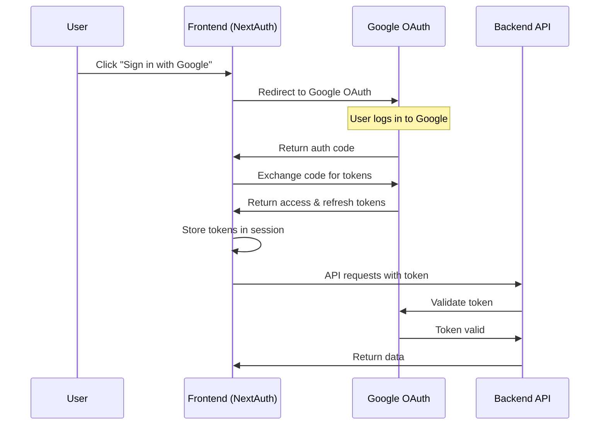
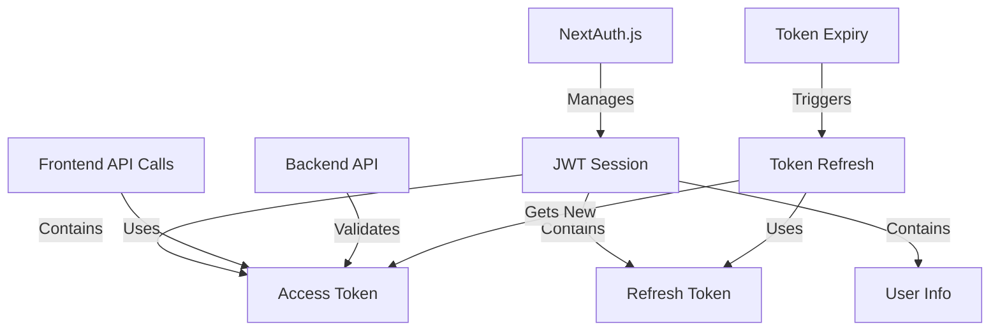
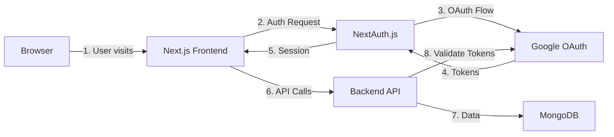
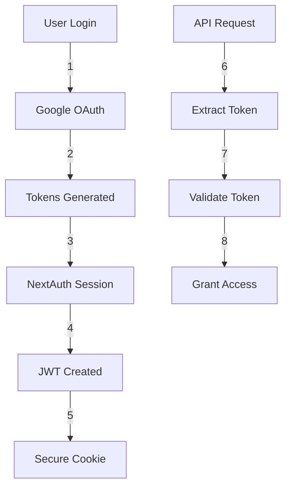

# Authentication Flow Explanation

## 1. OAuth 2.0 Flow with Google



## 2. Token Management Architecture



## 3. System Architecture



## How It Works

1. **Frontend (NextAuth.js)**:
   - Handles OAuth flow with Google
   - Manages user sessions
   - Stores tokens securely
   - Provides authentication state

2. **Google OAuth**:
   - Provides secure authentication
   - Issues access & refresh tokens
   - Validates tokens
   - Grants API permissions

3. **Backend API**:
   - Validates tokens with Google
   - Handles business logic
   - Manages data access
   - Provides API endpoints

4. **Token Types**:
   ```typescript
   interface Tokens {
     accessToken: string;   // Short-lived (1 hour)
     refreshToken: string;  // Long-lived (can be permanent)
     idToken: string;      // User identity information
   }
   ```

## Environment Setup

```env
# Frontend (.env.local)
GOOGLE_CLIENT_ID=your_client_id_here
GOOGLE_CLIENT_SECRET=your_client_secret_here
NEXTAUTH_URL=http://localhost:3000
NEXTAUTH_SECRET=your_nextauth_secret_here

# Backend Environment
JWT_SECRET=same_as_NEXTAUTH_SECRET
GOOGLE_APPLICATION_CREDENTIALS=path_to_service_account.json
```

## Security Flow



## Why Tokens?

1. **Access Token**:
   - Short-lived (1 hour)
   - Used for API access
   - Prevents unauthorized access
   - Can be revoked

2. **Refresh Token**:
   - Long-lived
   - Used to get new access tokens
   - Stored securely
   - Enables persistent sessions

3. **ID Token**:
   - Contains user information
   - Verified by Google
   - Used for authentication
   - Stateless verification

## Integration Points

1. **Frontend to Google**:
   - OAuth flow
   - Token management
   - User authentication

2. **Frontend to Backend**:
   - API requests with tokens
   - Data fetching
   - Real-time updates

3. **Backend to Google**:
   - Token validation
   - API access
   - User verification