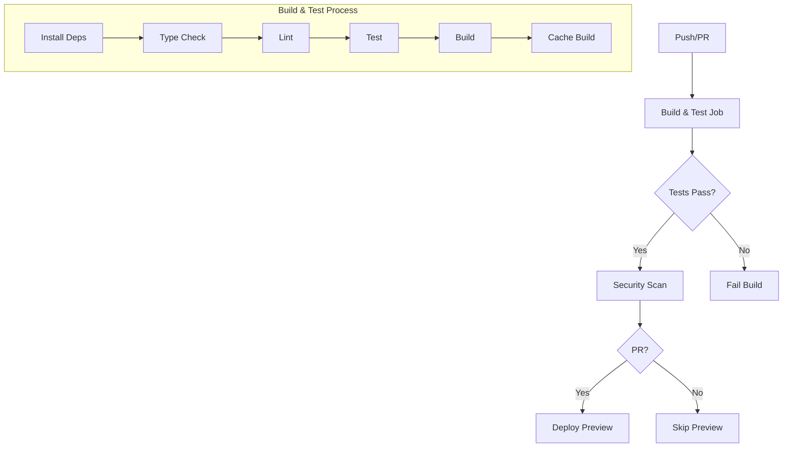
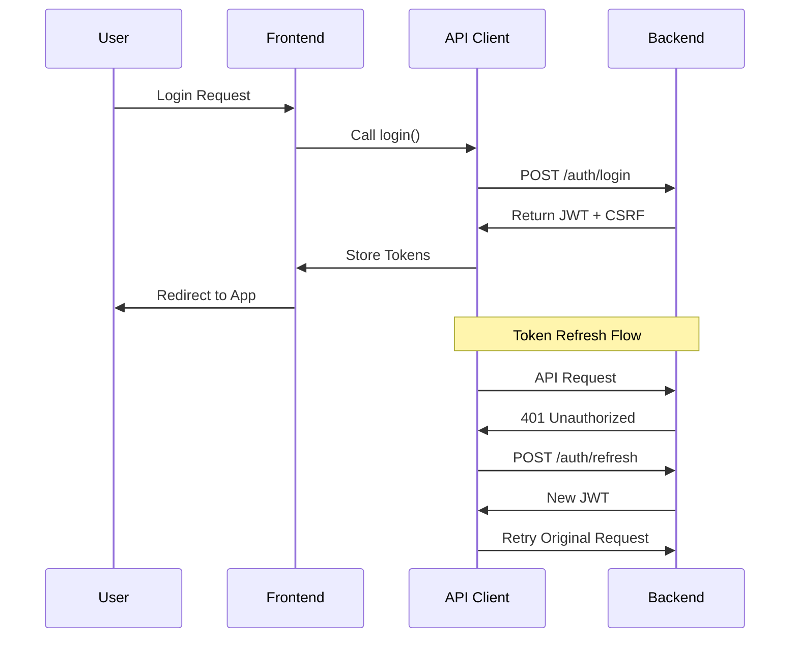
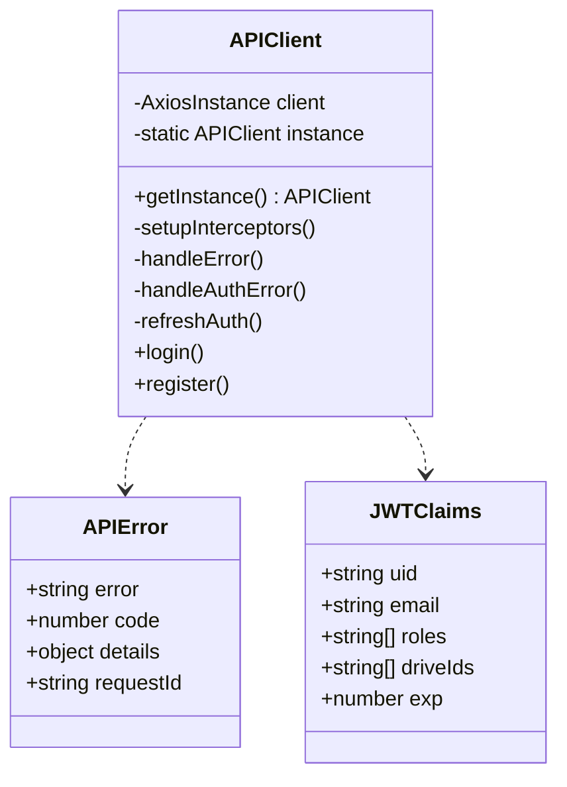
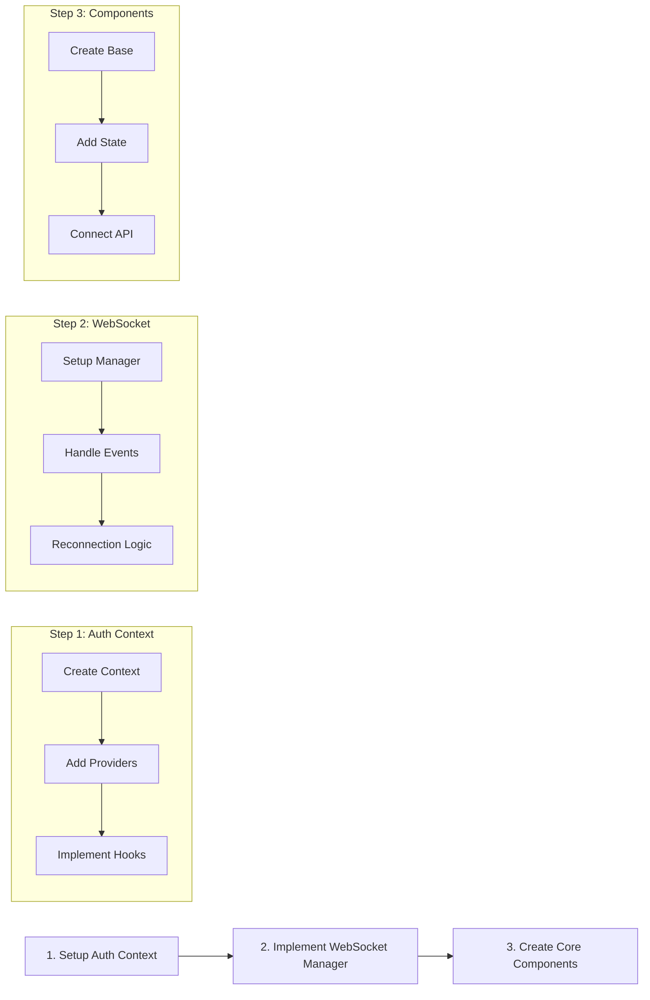
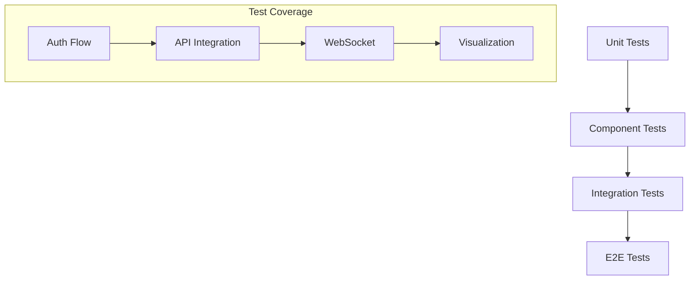

# Frontend Architecture and Workflow Explanation

## 1. CI/CD Pipeline Flow



## 2. Authentication Flow



## 3. API Client Architecture



## Current Status and Next Steps

### What Works:
1. ✅ Basic CI/CD pipeline structure
2. ✅ Type-safe API client implementation
3. ✅ Authentication flow design

### What Needs Testing:
1. 🧪 Token refresh mechanism
2. 🧪 Error handling scenarios
3. 🧪 CSRF token management
4. 🧪 Rate limiting behavior

### Issues Found:
1. ❌ Missing Vercel deployment configuration
   ```yaml
   # Current Error:
   Missing required input 'zeit-token'
   ```

### Next 3 Steps (Priority Order):



## Best Practices Implementation

### 1. Authentication Context (Next Step)
```typescript
// Recommended Structure
interface AuthContextType {
  user: JWTClaims | null;
  login: (email: string, password: string) => Promise<void>;
  logout: () => void;
  isLoading: boolean;
  error: string | null;
}
```

### 2. WebSocket Manager (Following Step)
```typescript
// Recommended Pattern
class WSManager {
  private static instance: WSManager;
  private ws: WebSocket | null = null;
  private reconnectAttempts = 0;
  private maxReconnectAttempts = 5;
  
  // Implementation details to follow
}
```

### 3. Core Components (Final Step)
```typescript
// Component Architecture
interface VisualizationProps {
  data: VisualizationData;
  settings: VisualizationSettings;
  onUpdate: (data: VisualizationData) => void;
}
```

## Testing Strategy



## Immediate Actions Required:
1. Fix Vercel deployment configuration
2. Set up environment variables
3. Create initial auth context implementation
